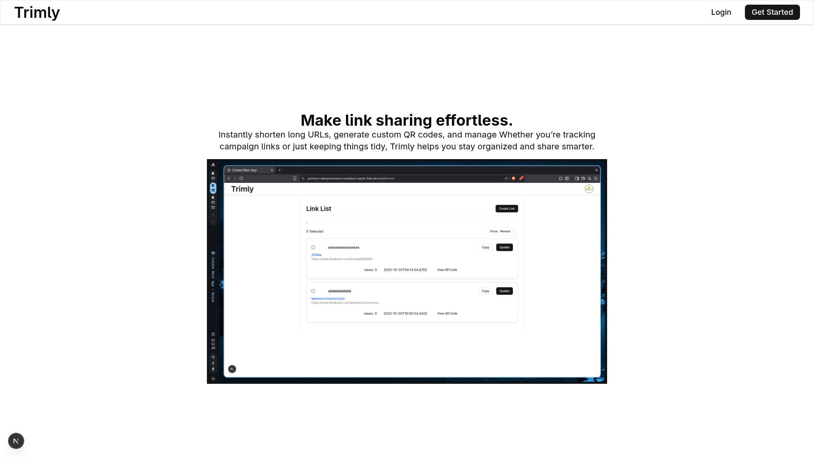
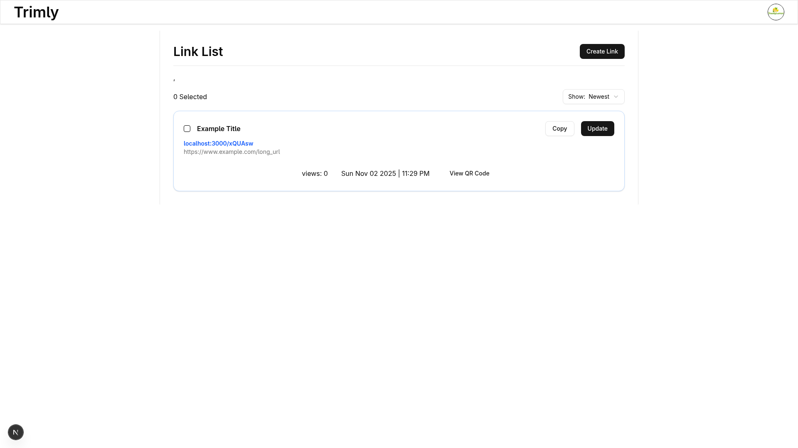
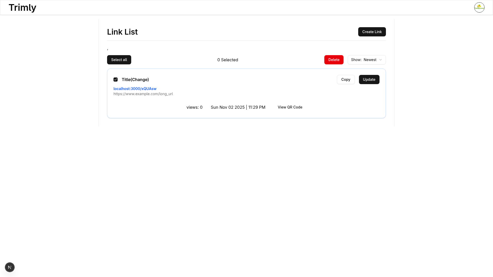
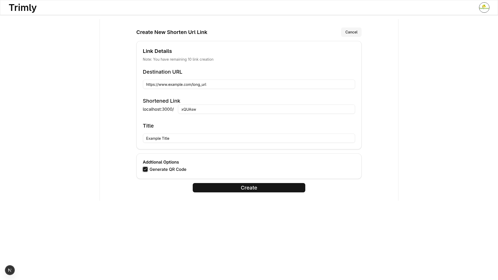
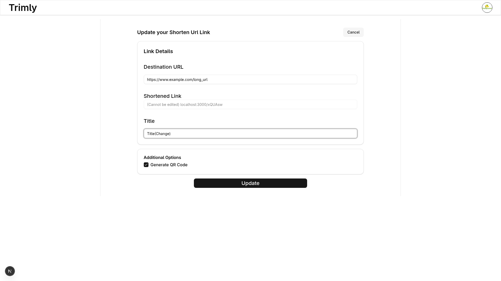

# Trimly

A modern URL shortener application that helps you create, manage, and track short links with ease.

## Features

- 🔗 **URL Shortening** - Convert long URLs into short, memorable links
- ✏️ **Link Management** - Create, update, and delete your shortened URLs
- 🎨 **Modern UI** - Clean and intuitive user interface

## Screenshots

### Home Page


### Dashboard



### Create Short Link


### Update Link


## Getting Started

### Prerequisites

- Node.js (v14 or higher)
- npm or yarn package manager

### Installation

1. Clone the repository
```bash
git clone https://github.com/yourusername/trimly.git
cd trimly
```

2. Install dependencies
```bash
npm install
# or
yarn install
```

3. Set up environment variables
```bash
cp .env.example .env
```
Edit `.env` and add your configuration:
```
DATABASE_URL=your_database_url

```

4. Run the development server
```bash
npm run dev
# or
yarn dev
```

5. Open [http://localhost:3000](http://localhost:3000) in your browser

## Usage

1. **Create a Short Link**
   - Navigate to the create page
   - Enter your long URL
   - Optionally customize your short URL slug
   - Click "Create" to generate your short link

2. **Manage Your Links**
   - View all your links in the dashboard
   - Edit link details by clicking the update button
   - Delete links you no longer need

3. **Share Your Links**
   - Copy your shortened URL
   - Share it anywhere you need
 
  
4. **Generate QR code**
- Easier to share
- Share it anywhere you need

## Tech Stack

- **Frontend**: Next.js
- **Backend**: NextJS Api Routes / Clerk
- **Database**: PrismaORm / PostgreSQL
- **Styling**: Tailwind CSS / CSS Modules


